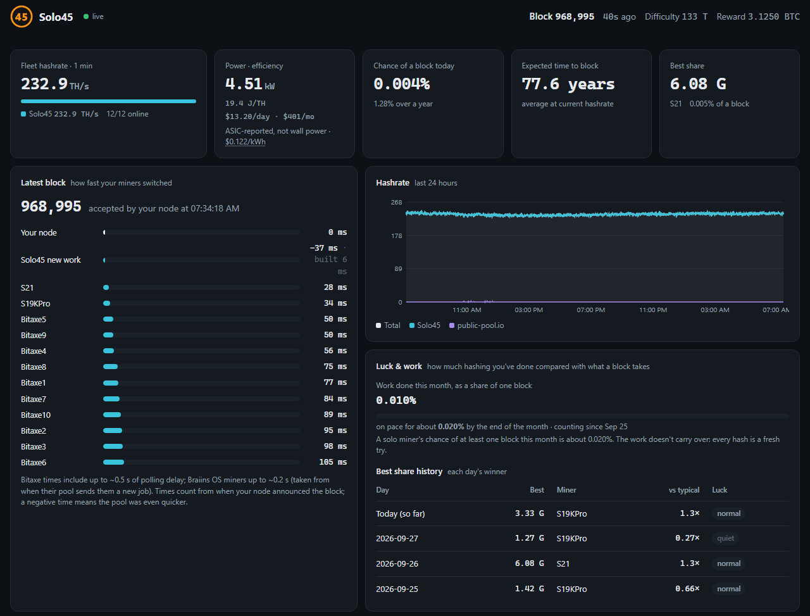
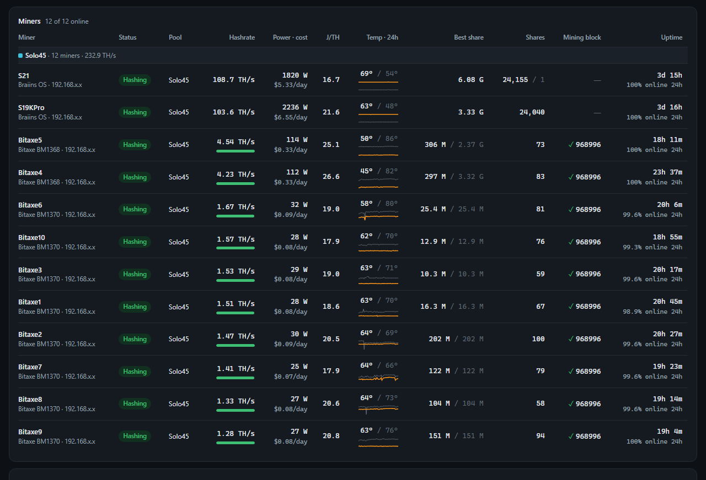
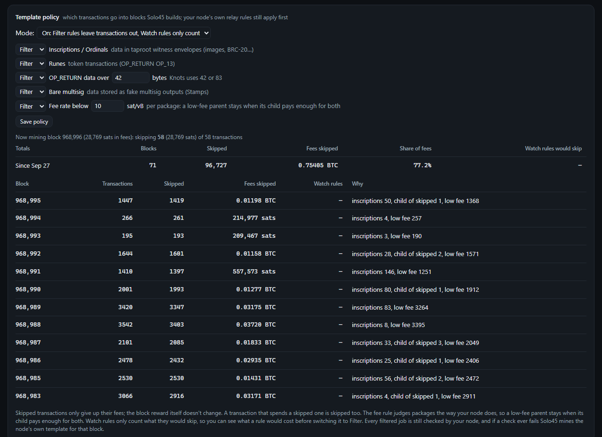
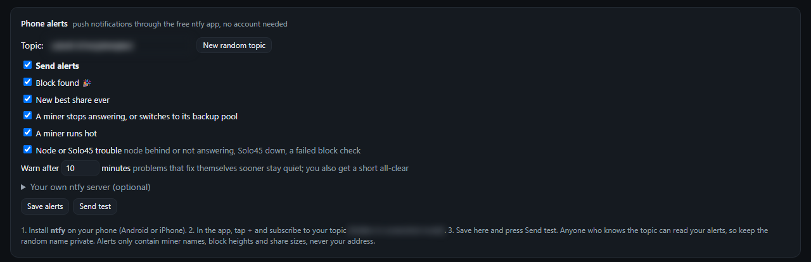

<p align="center"></p>

<h1 align="center">Solo45</h1>

<p align="center"><b>Your own solo Bitcoin mining pool and live mining dashboard, for Umbrel.</b><br>
Build blocks from your own node, keep 100% of any block you find, and watch your whole fleet on one page.</p>

<p align="center">
<a href="LICENSE"></a>


</p>



## Why Solo45

- **Your node, your block.** Solo45 builds work from your own Bitcoin node and puts your address in the coinbase. A found block pays you directly: no pool fee, no account, no middleman.
- **Every job checked by your node.** Each new job is validated with `getblocktemplate` "proposal" mode, so a broken block would show up within seconds, not on the day you find one.
- **Template policy.** Choose what goes into your blocks: leave out inscriptions/Ordinals, Runes, large OP_RETURN data, bare multisig (Stamps) or low fee rates. The fee rule judges transaction packages the way your node does (child pays for parent). Every rule can be **Off**, **Watch** (only count what it would skip, and what that would cost) or **Filter**.
- **Fast block switching, measured.** New work goes out within milliseconds of your node accepting a block, and the dashboard times how fast every miner switches.
- **Stall guard.** If a peer announces a block but never sends it, Solo45 disconnects that peer after 60 seconds (adjustable), instead of your miners hashing on an old block for 10 minutes.
- **A fleet dashboard, not just a pool.** Bitaxe (AxeOS) and Braiins OS miners are found automatically: hashrate (what the miner reports and what the pool measures), power, cost and J/TH, 24-hour temperatures, best shares, uptime and your odds.
- **Steady share difficulty.** Automatic vardiff per miner, remembered across restarts, or a fixed difficulty or share rate per miner.
- **Phone alerts** through the free [ntfy](https://ntfy.sh) app: block found, a new best share, a miner offline, on its backup pool or running hot, node or pool trouble.
- **Made for Umbrel.** Browser setup (no SSH), a home-screen widget, settings backup and restore, a screenshot mode that hides your address and IPs, and everything behind your Umbrel login.
- **Optional AI assistant.** Ask about your setup in plain English with your own Anthropic API key, with weekly and monthly spending limits.

## Install on Umbrel

1. In umbrelOS, open the **App Store**, click **⋯** (top right) → **Community App Stores**, add `https://github.com/race45race/solo45` and install **Solo45** from it. It needs the **Bitcoin Node** app, fully synced.
2. Open Solo45 and enter your **payout address**. Your node checks it before it's saved.
3. Point your miners at **`stratum+tcp://<your Umbrel's IP>:3333`** (use the IP address: many miners can't look up `umbrel.local`).

umbrelOS shows a warning when you add a community app store, because its apps aren't reviewed by the Umbrel team. Updates arrive through the normal **Update** button.

## Connecting miners

| Field | Value |
|---|---|
| Pool / stratum URL | `stratum+tcp://<Umbrel IP>:3333` (on a Bitaxe: host = the IP, port = 3333) |
| Username | `<Bitcoin address>.<worker name>`, for example `bc1q….Bitaxe1` |
| Password | anything, for example `x` |

- The **worker name** (after the dot) is how the miner shows up on the dashboard.
- With **Always pay my address** on (the default for new installs), every miner pays the payout address you set on the dashboard, whatever its username says, so `x.Bitaxe1` works fine.
- With it off, the **address** (before the dot) is where a block found by that miner is paid, handy for a friend's miner. If it isn't a valid address, Solo45 pays your payout address.
- Any Stratum v1 miner works; version rolling (ASICBoost) is supported.
- Keep a **backup pool** set on each miner (another solo pool), so they keep hashing while Solo45 or your Umbrel restarts.

## Screenshots

| Miners | Template policy |
|---|---|
|  |  |



The dashboard also works on a phone, and can be added to your home screen as an app.

## What's on the dashboard

- **Top line:** fleet hashrate, power and electricity cost, chance of a block today and this year, expected time to a block, best share ever.
- **Latest block:** how many milliseconds after your node accepted the block each miner got new work.
- **Miners:** status, pool, hashrate, power and cost, J/TH, temperature trend, best share, shares, the block each miner is working on, uptime.
- **Solo45 settings:** payout address and the "Always pay my address" switch, how often jobs refresh, the stall guard, and share difficulty per miner.
- **Template policy:** the rules, what they skipped per block, and totals for the last 24 hours, 7 days and 30 days.
- **Phone alerts, best share today, network and node, live shares, recent blocks, the AI assistant, backup and restore.**

Handy extras: **Screenshot mode** (footer) hides your payout address, IP addresses and alert topic so you can share screenshots. "Best share today" resets at *your* midnight (the time zone comes from your browser).

## How it works

- `src/pool.py` is the Stratum v1 pool. It asks your node for block templates over RPC, hears about new blocks through the node's long-poll (with a check every 100 ms as a backup), refreshes jobs with new transactions every 30 seconds (adjustable), has the node check each job, and submits a found block straight away.
- `src/server.py` is the dashboard. It polls the miners' own local APIs (AxeOS over HTTP, Hammer Thor OS over HTTP, Braiins OS over the CGMiner API on port 4028), hears about new blocks from the node's ZMQ feed, and serves one page with live updates.
- `src/policy.py` is the template policy, `src/stallguard.py` the stall guard.
- The pool and dashboard use only the Python standard library; the optional AI assistant uses the `anthropic` library.

## Run without Umbrel

Solo45 is a normal Docker app. You need a Bitcoin Core (or Knots) node with RPC access, and ideally `zmqpubhashblock` turned on.

```yaml
services:
  pool:
    image: ghcr.io/race45race/solo45:v0.1.30
    command: ["python", "/app/pool.py"]
    restart: on-failure
    stop_grace_period: 30s                 # lets a found block reach the node before the pool stops
    ports:
      - "3333:3333"                        # stratum for your miners (don't publish 3380, the pool's API)
    volumes:
      - ./data/pool:/data/pool
    environment:
      SOLO45_DATA_DIR: /data/pool
      BITCOIN_ZMQ_HASHBLOCK: tcp://your-node:28334  # optional: new blocks the moment the node has them
      SOLO45_API_TOKEN: change-me-to-a-long-random-string
      BITCOIN_RPC_URL: http://your-node:8332/
      BITCOIN_RPC_USER: your-rpc-user
      BITCOIN_RPC_PASS: your-rpc-password

  dashboard:
    image: ghcr.io/race45race/solo45:v0.1.30
    command: ["python", "/app/server.py"]
    restart: on-failure
    ports:
      - "8099:8099"                        # the dashboard
    volumes:
      - ./data/dash:/data/dash
      - ./data/pool:/data/pool:ro
    environment:
      SOLO45_DASH_DATA: /data/dash
      SOLO45_POOL_LOG: /data/pool/pool.log
      SOLO45_API_BASE: http://pool:3380
      SOLO45_API_TOKEN: change-me-to-a-long-random-string   # the same as the pool's
      BITCOIN_ZMQ_HASHBLOCK: tcp://your-node:28334
      BITCOIN_RPC_URL: http://your-node:8332/
      BITCOIN_RPC_USER: your-rpc-user
      BITCOIN_RPC_PASS: your-rpc-password
```

> **Important:** outside Umbrel there is no login in front of the dashboard. Anyone who can open port 8099 can see your miners and change settings, including the payout address. Only run it on a network you trust, or put it behind a reverse proxy with a password. The pool's own API (port 3380) only answers the machine it runs on, or requests carrying `SOLO45_API_TOKEN`: set the same long random one on both containers (the dashboard needs it) and leave that port unpublished.

Both programs also run straight from the source with Python 3 (tested with 3.13): `python3 src/pool.py` and `python3 src/server.py`. `python3 src/selftest.py` checks the pool against your live node (block hashing, merkle roots, templates the node accepts, the template policy and more).

## Security and privacy

- The stratum port (3333) is open to your local network, because your miners need it. **Don't forward it to the internet.** Solo45 limits connections per address and drops connections that don't log in within 2 minutes, but it's built for a home network.
- Settings can only be changed, and the live data only read, through the Umbrel login. The pool's own API only answers the dashboard, with a per-install secret.
- With **Always pay my address** on, nobody else on your network can point a miner at your pool and mine to their own address.
- No telemetry. Solo45 only talks to your node and your miners, plus [ntfy](https://ntfy.sh) and Anthropic if you turn on alerts or the AI assistant.
- The settings backup file contains your payout address and alert topic: keep it private.

## FAQ

**Is there a fee?** No. A found block pays its full reward (subsidy plus fees) to your address.

**Does share difficulty change my chance of finding a block?** No. It only changes how often miners report shares. Every hash has the same chance.

**What happens when I find a block?** Solo45 submits it to your node right away, the dashboard celebrates, and your phone gets an alert if you set them up. The reward can be spent after 100 confirmations (about 17 hours).

**Does it work with Bitcoin Knots?** It only uses standard RPC and ZMQ, so it should, including through Umbrel's alternative node apps. So far it has been tested with Bitcoin Core 31.1.

**Raspberry Pi?** The images are built for arm64 and amd64, and every release's tests also run on real ARM hardware. The pool settles at about 60 MB of memory (about 100 MB for the whole app), and on the author's x86 Umbrel it sends new work about 30 ms after a new block. Raspberry Pi testers are very welcome.

**What does the template policy cost me?** Only the fees of the transactions you leave out. The dashboard shows it per block and for the last 24 hours, 7 days and 30 days. Use Watch mode to see the cost of a rule before you turn it on.

## Status

Solo45 is young (v0.1.x) but in daily use on its author's Umbrel, with 13 miners: ten Bitaxes, a Hammer Thor X1, an Antminer S21 and an S19K Pro. Feedback, bug reports and testers are welcome: please [open an issue](https://github.com/race45race/solo45/issues).

Solo mining is a lottery. Even with a few hundred TH/s, the expected time to find a block is decades; any single day is a long shot. Mine because you enjoy it and to help decentralize Bitcoin, not as an investment.

## License

MIT, see [LICENSE](LICENSE).
